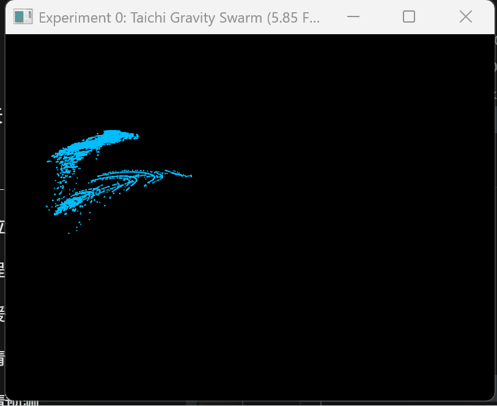

# CG-Lab

## 项目简介

本项目基于 Taichi 实现了一个二维万有引力粒子群仿真程序。  
程序通过并行计算模拟多个粒子之间的引力相互作用，并实时渲染粒子运动效果，形成类似星系旋转的动态可视化结果。

## 项目结构

```text
CG-Lab
├─ README.md
├─ pyproject.toml
├─ .gitignore
├─ demo.gif
└─ src
   └─ Work0
      ├─ __init__.py
      ├─ config.py
      ├─ physics.py
      └─ main.py


## 运行方法

在项目目录运行：

```bash
py -3.11 -m src.Work0.main

## 运行效果演示

